# Does my pint need filling?

Daniel Rennie

## Introduction

My project's idea was to create a sensor that could detect whether a pint needed a refill. The inspiration came from the image classification and object detection lecture and the face detection lecture with the Arducam. I thought that if a sensor could detect a human face, then more than likely, with a bit of help and the correct data, that this could be extended to determining whether or not a pint needed a refill. My objective was for the sensor to detect three outcomes with 80% accuracy:

1. **Refill required** - a pint glass was less than 50% full
2. **No refill required** - a pint glass was over 50% full
3. **Not a drink** - the object in view was not a drinking glass

In the end, using Edge Impulse [1] to create the model architecture,  OpenMV Cam H7 Plus as the sensor and OpenMV IDE to connect the hardware and software, a successful pint detecting camera was built. The final model used was 81.48% accurate at detecting the appropriate outcomes on the unseen test data surpassing my objective.

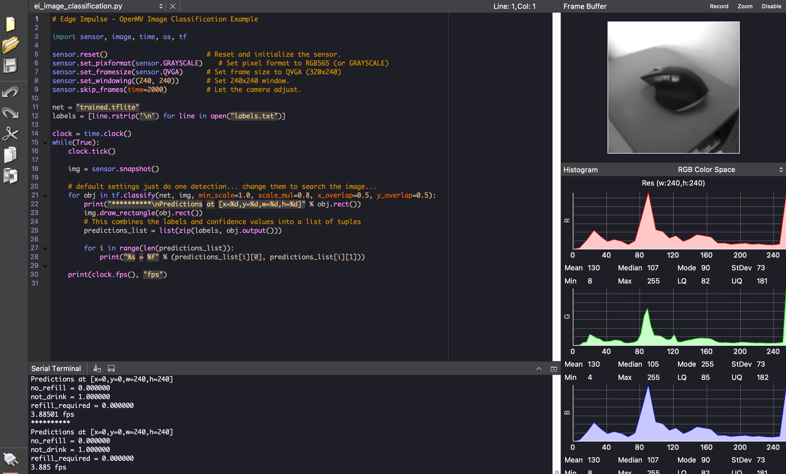
**Image 1.**  OpenMV IDE Screenshot - Shows the correct detection of a mouse not being a drink

**Image 2.**  OpenMV Cam H7 Plus detecting the mouse with OpenMV IDE in the background

## Research Question

Can I create a sensor that can predict whether or not a pint needs a refill?

## Application Overview

As mentioned in the introduction, the application components were Edge Impulse, an OpenMV Cam H7 Plus and the OpenMV IDE.

I  used Edge Impulse in three main ways:

1. Data storage, tagging and splitting
2. Model building, training and testing
3. Model deployment to edge device

While the model's data will be covered in more detail in a subsequent section for the application overview, collected data was uploaded into Edge Impulse, then tagged with the appropriate outcome and then split into training or test data.

The model was built using Edge Impulse's user interface. Edge Impulse allows you to adjust different parameters like the number of training epochs and the learning rate. The model itself will be covered more in the Model section, however. The model training and testing were also completed using Edge Impulse's user interface as well.

Edge Impulse allows the machine learning model to be easily exported to OpenMV Cam H7 Plus. It exports the model in three files that are then opened in the OpenMV IDE and directly uploaded into the OpenMV Cam. Please see the files below:

1. ei_ image _classification.py - played in the OpenMV IDE
2. labels.txt - uploaded into the OpenMV Cam directly
3. trained.tflite - uploaded into the OpenMV directly

Lastly, OpenMV IDE allows you to run the program, see the camera's vision and interpret the model's outputs as seen in Image 1 above.

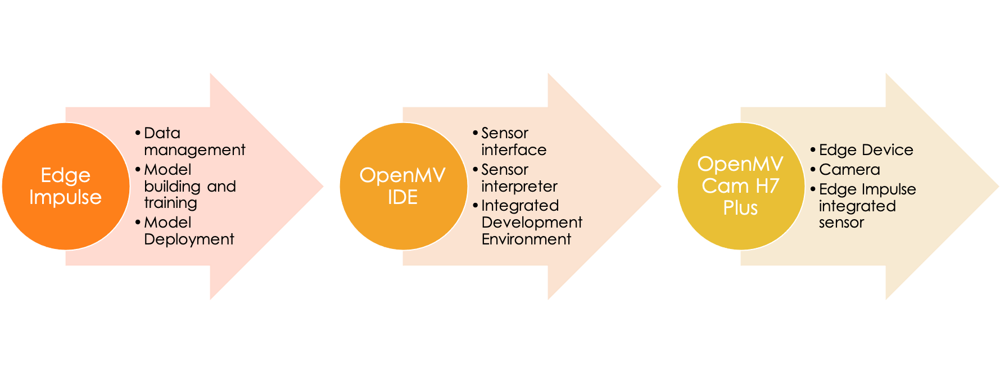
**Image 3.** Pint Detection Application Overview

## Data

I collected the majority of the data for this project with some help from our classmate Simone Rossi. The final dataset consisted of 510 images.

The dataset was first made up of 406 images of 9 different glasses with various states of "fullness" and various kinds of liquids inside them, ranging from water to stouts. The pint data was supplemented by 104 images of different items that were not pint glasses ranging from my face to a computer mouse.

The 510 images were then split into training and testing data. The training data consisted of 402 pictures, and the test data consisted of the remaining 108 images.

Edge Impulse then processed the images by "squashing" the images into a 96x96 image. Squashing the images means they are resized, and the aspect ratio is ignored. Edge Impulse then converted the images into grayscale from their original colour state.

The data was collected using mobile cameras, either directly connected to Edge Impulse or first taken by the mobile camera and then uploaded into Edge Impulse and by the OpenMV Cam H7 Plus synced with Edge Impulse. I then classified each image to align to one of the three outcomes. The final splits are shown below:

1. **Refill required** - 178 training images and 44 test images
2. **No refill required** - 146 training images and 38 test images
3. **Not a drink** - 78 training images and 26 test images

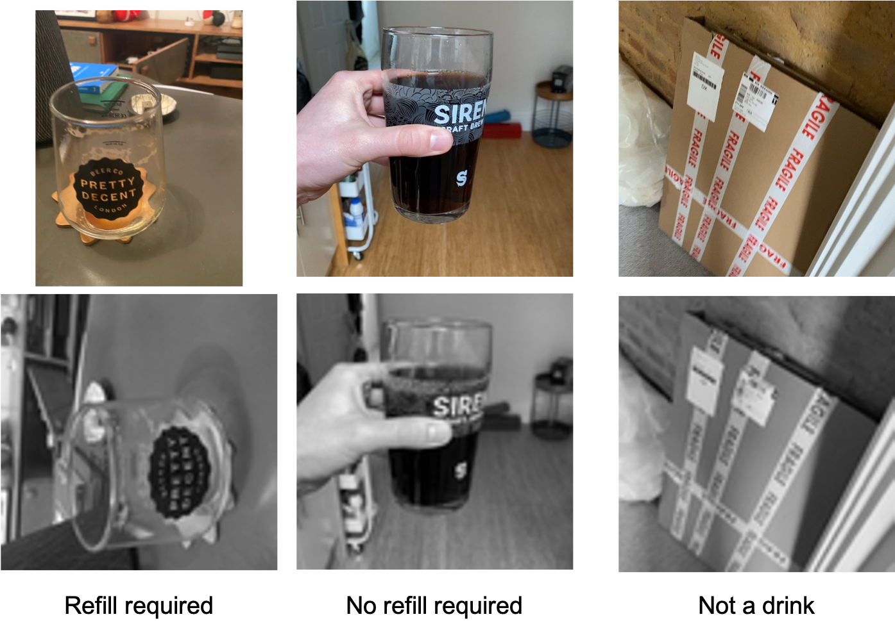
**Image 4.** Original and Processed Images for Pint Detection Application Model

## Model

Edge Impulse makes creating a machine learning model straightforward. Image detection is one of their template processing blocks in their Impulse design section and when selected Edge Impulse preprocesses and normalises the image data. The second choice in setting up the model in Edge Impulse is to choose a learning block. Edge Impulse's Transfer Learning block is recommended for image detection and selected for this model.

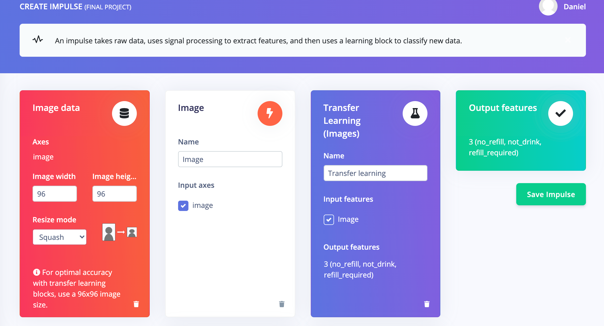
**Image 5.** Impulse Design within Edge Impulse User Interface

As mentioned in the data section, after some experimentation, which will be covered later, the first parameter I had to decide was how to process the images. I found that squashing and converting the images to grayscale performed best.

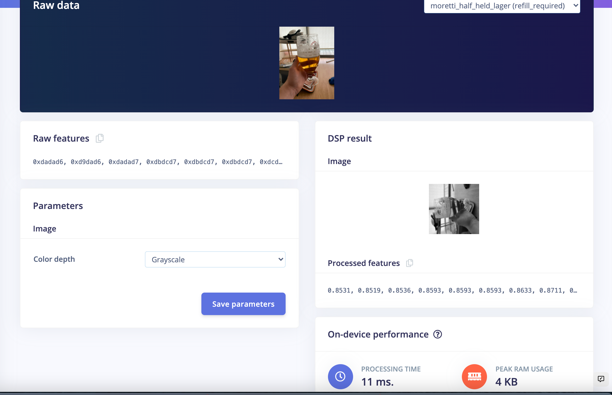
**Image 6.** Image Parameter Selection with Edge Impulse User Interface

The final model building step in Edge Impulse is done within their transfer learning block. Within this block, you have three options on how to adjust the model:

1. Edge Impulse User Interface
2. Edge Impulse Keras (expert) mode
3. Export and edit as an iPython notebook

When building this model, I used a combination of options 1 and 2, and after experimentation, the best performing model was created using the Edge Impulse User Interface.

The image below shows the parameters chosen for the model in the Edge Impulse user interface.

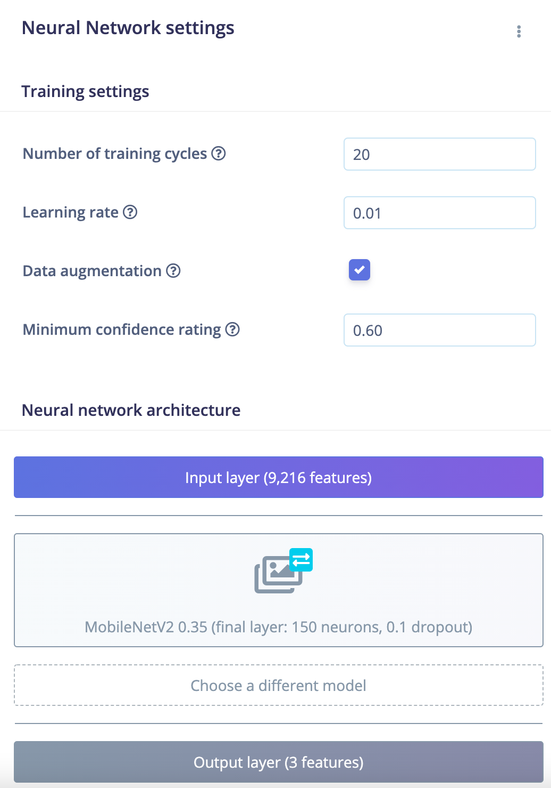
**Image 7.** Pint Detection Model Neural Network Architecture in the Edge Impulse User Interface

The images below show how the model is built in the Edge Impulse Keras (expert) mode. The key parameters to take away are the following:

* Transfer Learning Weights from MobileNetV2 0.35
* Dense Layer with 150 neurons
* Drop out layer with a rate of 0.1
* Flatten Layer
* A final dense layer with a Softmax activation
* Compile layer with an Adam optimiser
* Fine tune model at the end with 10 epochs, 65% fine-tune percentage and optimised again with Adam

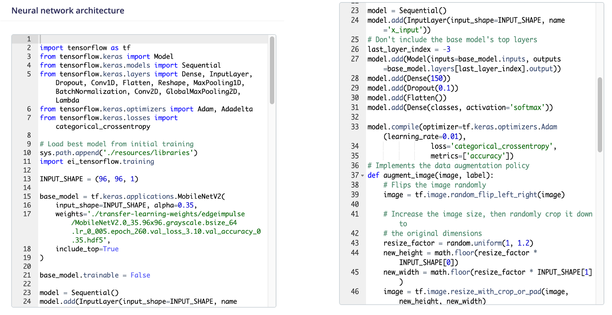
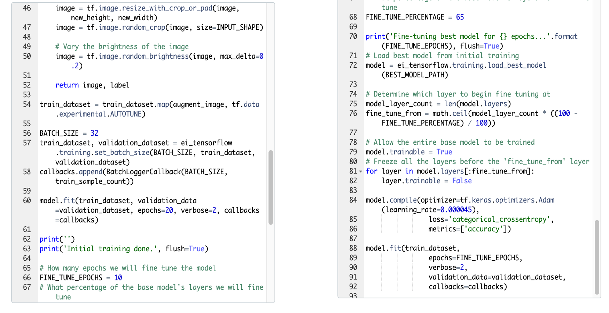
**Image 8.** Pint Detection Model Neural Network Architecture in Edge Impulse Keras (expert) mode

For this project, I did not try any other model frameworks as the Edge Impulse base model worked well from the very beginning. However, I experimented with the model in several ways, which will be covered in the next section.

## Experiments

I ran 29 experiments on the final dataset tweaking a different combination of the variables in the table below.

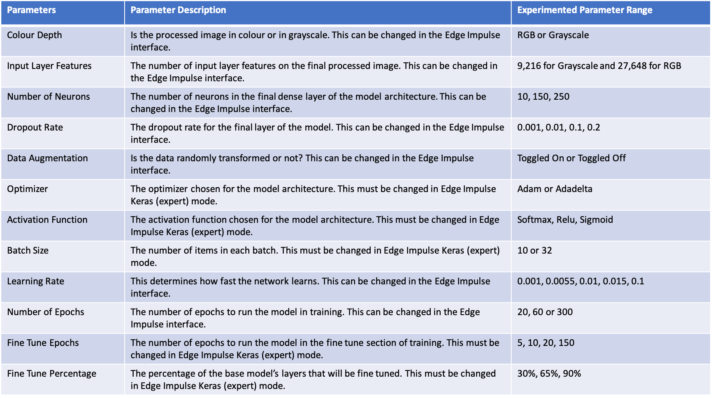
**Table 1.** Table describing the various parameter changes made during experimentation

I judged the experiment on its Quantized (int8) training performance and test data performance. The table below shows the poorest performing and best-performing experiments. 

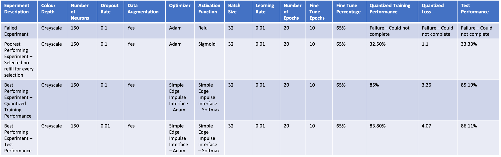
**Table 2.** Table showing the poorest and best performing models from experimentation

Overall, grayscale performed much better than colour did, and the majority of the experiments were completed using grayscale. Using grayscale had the added benefit of creating a smaller model than in RGB as well. Similarly, 150 neurons performed better than 10 or 200 through testing by a significant margin, and this was the most consistently used number.

Almost frustratingly, the changes available directly Edge Impulse user interface were the only ones needed to create the best performing model. When tweaking things like the activation later or optimizer in the Edge Impulse Keras (expert) mode, I often did more harm than good, as evidenced by the failed experiment in table 2 after switching the activation function to relu from softmax.

I tracked my experiments and parameter changes using a Google sheet and transcribing the model architecture and the subsequent results. While I did not write any scripts or create any graphs from this Google sheet, Edge Impulse makes a feature explorer highlighting how the model did on the complete training set.

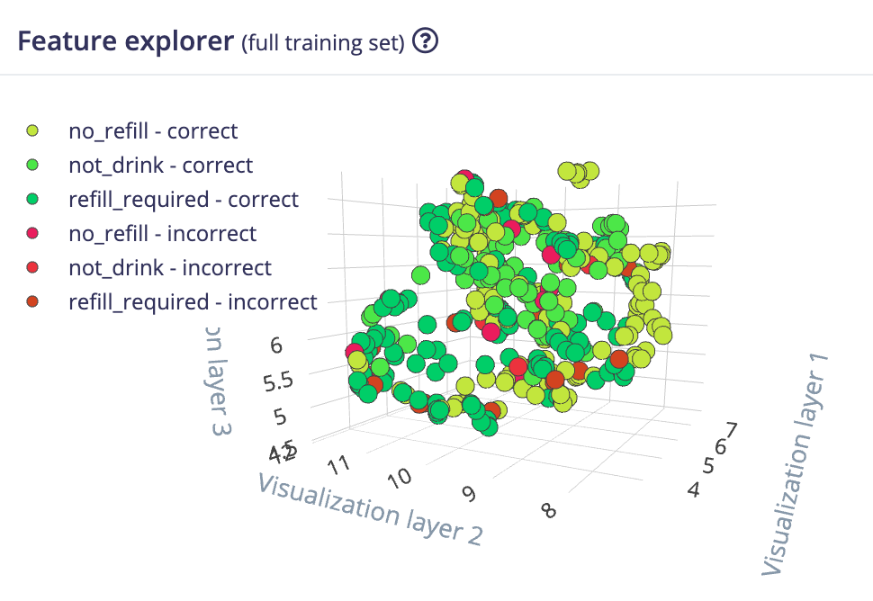
**Image 9.** Screenshot from Edge Impulse showing the Feature explorer highlighting the data that the model assessed both correctly and incorrectly

The feature explorer visualises the dataset as assessed by the model over three axes. It highlights the data that is has set correctly for each outcome as well as though that it incorrectly evaluated. The closer the data points in the feature explorer, the closer the model has assessed the different images. An excellent way to highlight this is to showcase the images in light green (no_refill - correct) from image 9.

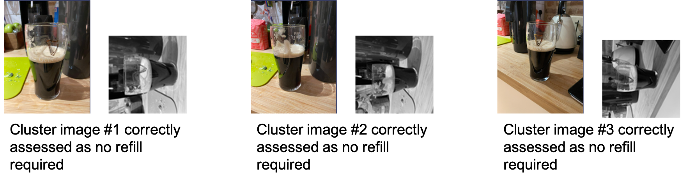
**Image 10.** Raw and processed images from the clustered light green data points in the Feature explorer show in Image 9

The model does quite well group the different pint glass types, as evidenced by the three Guinness glasses in Image 10. This can be further explored to the link to the Edge Impulse model in the appendix.

## Results and Observations

As shown in the experiments section, the best performing models had between 80% and 86% accuracy on both the training and test datasets. The image below shows the model that was subsequently uploaded onto the OpenMV Cam H7 Plus.

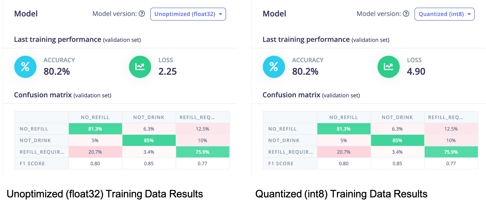
**Image 10.** Training Data Results

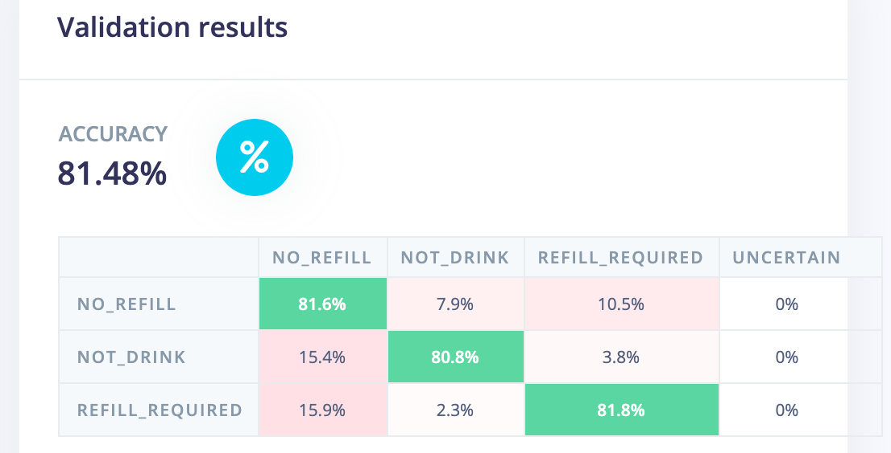
**Image 11.** Test Data Results

Overall, the model performed the desired result with the final parameters, achieving over 80% consistently. However, there were some noticeable trends where it failed:

1. **Glass shaped objects** - For example, I have an opaque water bottle that is consistently labelled as no refill required when it should not be a drink. However, as seen in image 11 below, the bottle is a similar shape to a pint glass and the reason it makes a mistake is apparent.
2. **Angle of the photo** - I intentionally took photos of pint glasses from several different angles to put in a little bit of noise to the model. However, this did decrease the performance as the model struggled with photos from high or low angles. It performed best when the images were taken directly from the side of a pint glass, as seen in image 11 below.
3. **Different glass types** - Like the camera angle, I used many different glass types for photos. Traditional, full pint glasses (e.g. Guinness glasses) were the most numerous and had the best results. The model struggled with shorter 2/3 sized pint glasses, as seen in image 11 below.
4. **Liquid type** - Quite obviously, the model worked better with darker liquids (e.g. stouts) versus more transparent liquids (e.g. water). The darker the liquid, the greater the contrast between the glass and the liquid within.

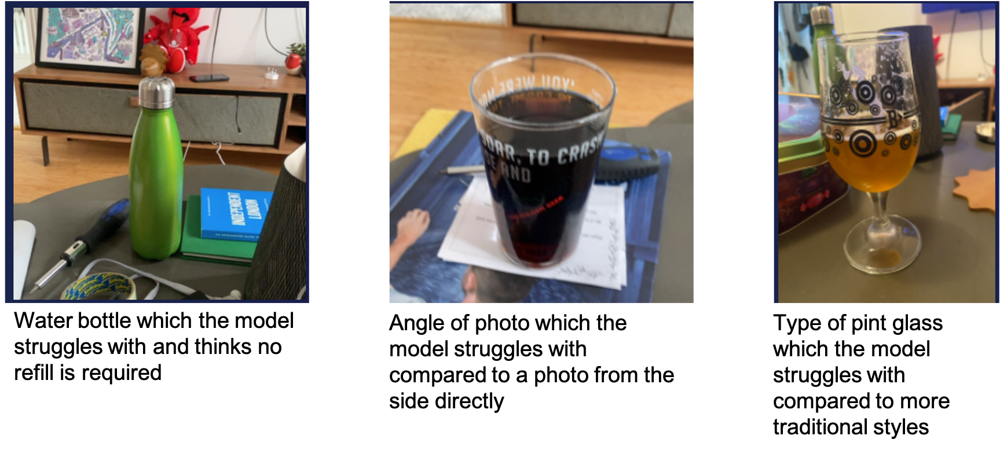
**Image 12.** Examples of images where the model struggles

If I had more time or if this was going to be used in a restaurant or pub to aid bartenders or servers in recognising which patrons required a refill more quickly, there would be two things I'd focus on:

1. **Consistent pint glasses and levels** - I would try and use as few different types of pint glasses as possible so that the model can learn on those more accurately. I would also be more exacting about where the threshold is when a refill is required so the model can remove as much of the guesswork inherent in my estimates as possible.
2. **Consistent angle of the images** - I imagine a camera, like the OpenMV Cam H7 Plus, being set up directly into a bar or the side of a table with a clear line of sight onto a coaster positioned for this application. Customers, who want to participate in this, would be asked when they're not drinking their pints to place them in that specific spot, and the application would determine for them if they require a refill. If the application could consistently assess the same types of pint glasses from the same positions, the accuracy would increase.

In the end, this was an enjoyable and exciting model to create. Edge Impulse allowed me to quickly build on what we learnt in class to complete an application that worked on an edge device to detect whether or not a pint needed a refill, and to that, I say cheers!

## Bibliography

1. Edge Impulse. San Jose, CA, USA. https://www.edgeimpulse.com/

## Declaration of Authorship

I, Daniel Allen Rennie, confirm that the work presented in this assessment is my own. Where information has been derived from other sources, I confirm that this has been indicated in the work.

Daniel Allen Rennie

29 April 2021

## Appendix

Edge Impulse Library Link - Please note this is the final public version of the project. If you require access to the previous versions where different versions of testing have been done then please reach out and ask for my login details.
[https://studio.edgeimpulse.com/public/22629/latest/learning/keras-transfer-image/23](https://studio.edgeimpulse.com/public/22629/latest/learning/keras-transfer-image/23)

GitHub Repository
[https://github.com/darennie/casa0018/tree/main/Assessment
](https://github.com/darennie/casa0018/tree/main/Assessment)